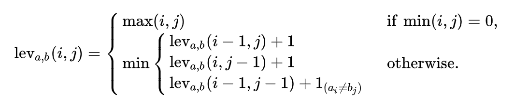

# spellcheck

Quick implementation of the Levenshtein Formula in Java. Gives spelling suggestions of a single word off a database of 370,101 English words. Because of the size of database, the algorithm is very slow. You can test it with a smaller one (though you may have to tinker with the csv parsing to get it to work properly), try smaller words, or add your own optimizations to the program. There are many ways it can be optimized, and I may come back in the future to improve it.

[source](https://www.irjet.net/archives/V8/i9/IRJET-V8I9316.pdf)

